# 🏦 Credit Risk and Portfolio Analysis

<p align="center">
  
  
  
  
  
  
</p>  

## 📌 Project Overview

This project analyzes a bank loan portfolio to evaluate **loan performance, repayment behavior, borrower risk, and portfolio profitability**. The analysis combines Python-based exploratory data analysis with a Power BI dashboard to help banking stakeholders monitor loan health, identify high-risk segments, and make better underwriting decisions.

The project focuses on key business questions such as:

- How many loan applications were received?
- How much capital was funded and recovered?
- What percentage of loans are good vs. bad?
- Which states, loan purposes, terms, and borrower segments drive the portfolio?
- Where are the biggest risks and profitability opportunities?

## 🎯 Business Objective

The bank receives loan applications from customers across different states, income groups, employment backgrounds, home ownership categories, and loan purposes. However, without a clear analytical view, it becomes difficult to identify profitable borrowers, default-prone segments, repayment trends, and regional concentration risks.

The objective of this project is to build a complete analytical view of the lending portfolio so the bank can:

- ✅ Track operational and financial KPIs
- ✅ Compare good loans vs. bad loans
- ✅ Detect high-risk borrower segments
- ✅ Understand monthly lending trends
- ✅ Improve underwriting and approval strategy
- ✅ Reduce charge-offs and strengthen portfolio performance

## 🧾 Project Labels

| Label | Description |
|---|---|
| 🏦 **Industry** | Banking, Lending, Financial Services |
| 📊 **Project Type** | Data Analytics, BI Dashboard, EDA |
| 🧠 **Analysis Focus** | Portfolio health, borrower risk, repayment behavior |
| ⚙️ **Tools Used** | Python, Jupyter Notebook, Power BI, Pandas, NumPy, Matplotlib, Seaborn, Plotly |
| 📁 **Dataset** | Financial loan portfolio data |
| 🎯 **Outcome** | Executive-ready insights and interactive reporting |

## 📊 Key Portfolio Metrics

| Metric | Value |
|---|---:|
| 📝 Total Loan Applications | **38,576** |
| 💰 Total Funded Amount | **$435.76M** |
| 💵 Total Amount Received | **$473.07M** |
| 📈 Net Cash Gain | **$37.31M** |
| 🏷️ Average Interest Rate | **12.05%** |
| ⚖️ Average DTI | **13.33%** |
| ✅ Good Loan Applications | **33,243** |
| ⚠️ Bad Loan Applications | **5,333** |
| ✅ Good Loan Rate | **86.18%** |
| ⚠️ Bad Loan Rate | **13.82%** |

## 🗓️ Latest Month Performance

Latest available month: **December 2021**

| MTD Metric | Value |
|---|---:|
| 📝 MTD Loan Applications | **4,314** |
| 💰 MTD Funded Amount | **$53.98M** |
| 💵 MTD Amount Received | **$58.07M** |
| 📈 MTD Average Interest Rate | **12.36%** |
| ⚖️ MTD Average DTI | **13.67%** |

## ✅ Good Loan vs. Bad Loan Analysis

Good loans include loans marked as **Fully Paid** or **Current**. Bad loans include loans marked as **Charged Off**.

| Loan Category | Applications | Funded Amount | Amount Received | Net Impact |
|---|---:|---:|---:|---:|
| ✅ Good Loans | **33,243** | **$370.22M** | **$435.79M** | **+$65.56M** |
| ⚠️ Bad Loans | **5,333** | **$65.53M** | **$37.28M** | **-$28.25M** |

### 🔍 Insight

The portfolio is largely healthy, with **86.18% good loans**. However, the **13.82% bad loan segment** creates a meaningful financial drag, producing an estimated **$28.25M loss**. This makes default reduction and borrower risk segmentation critical priorities.

## 📌 Dashboard & Analysis Areas

The analysis covers the following dashboard views and analytical dimensions:

- 📈 **Monthly Trends** by issue date
- 🗺️ **Regional Analysis** by state
- ⏳ **Loan Term Analysis** for 36-month and 60-month loans
- 👔 **Employment Length Analysis**
- 🎯 **Loan Purpose Breakdown**
- 🏠 **Home Ownership Analysis**
- ✅ **Good Loan vs. Bad Loan KPIs**
- 💳 **Portfolio Profitability and Repayment Behavior**

## 🖼️ Visual Dashboard Gallery

### 📈 Monthly Portfolio Trends

| Funded Amount by Month | Amount Received by Month |
|---|---|
|  | 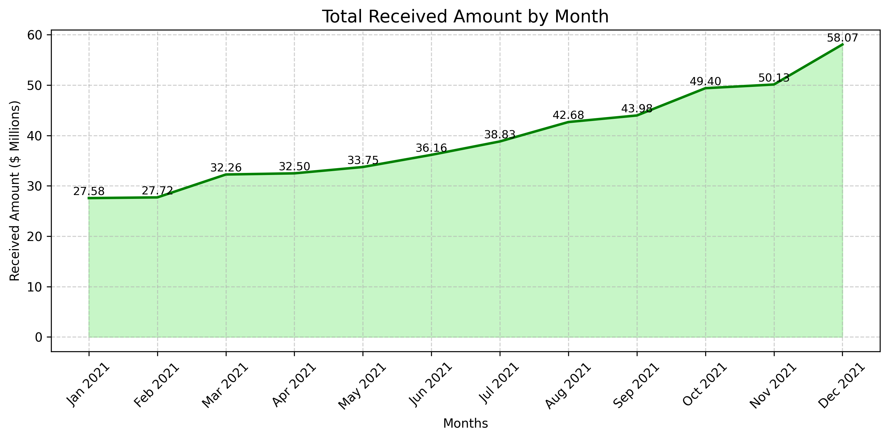 |

| Loan Applications by Month |
|---|
| 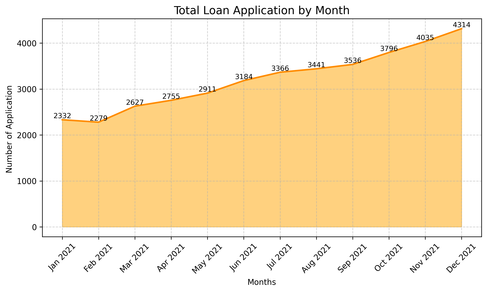 |

### 🗺️ Regional Performance

| Funded Amount by State | Amount Received by State |
|---|---|
| 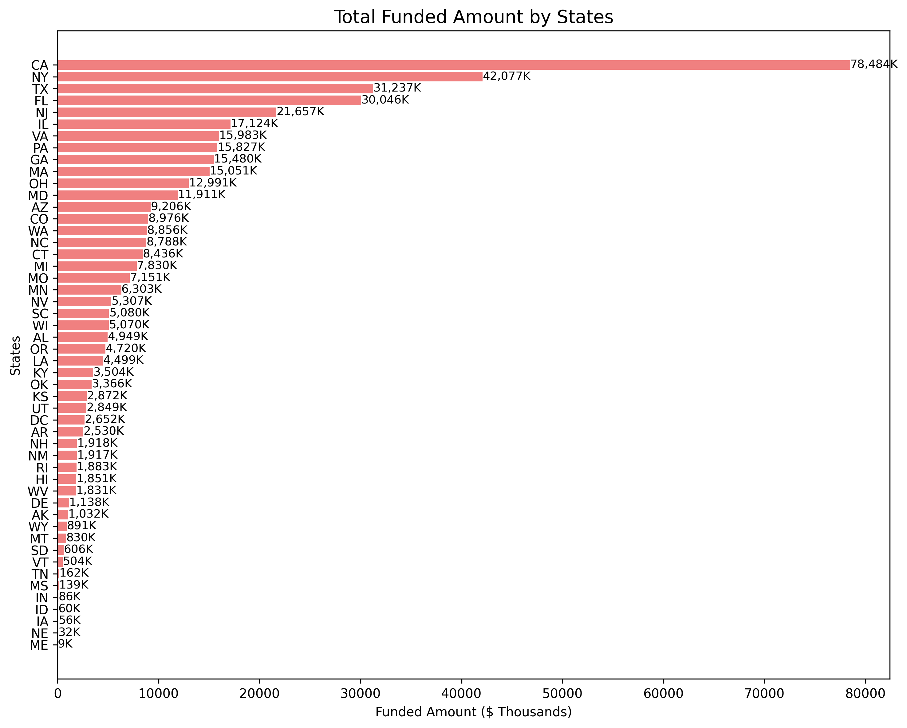 | 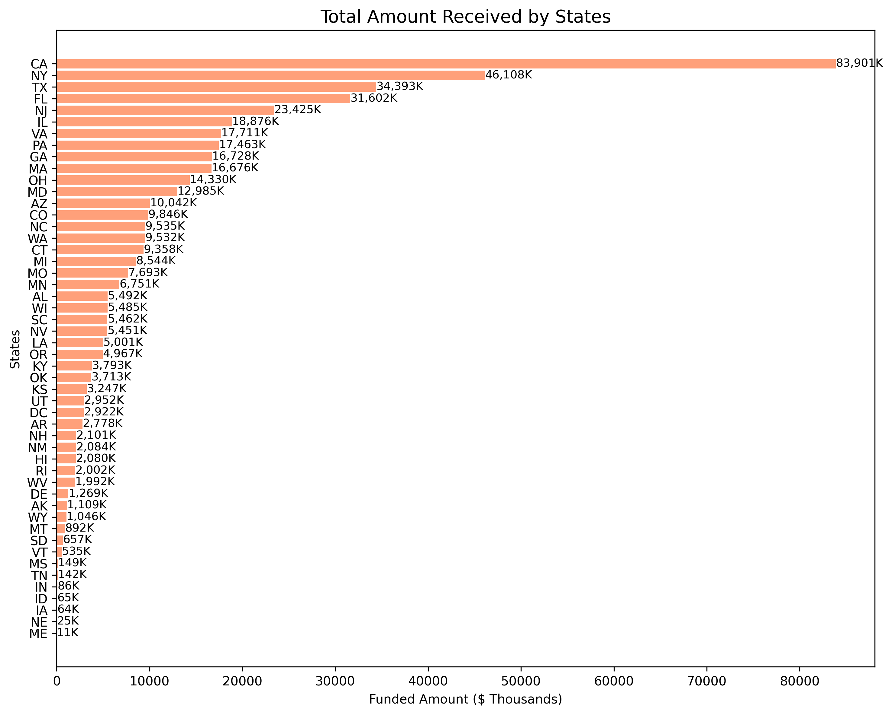 |

### ⏳ Loan Term Performance

| Funded Amount by Term | Amount Received by Term |
|---|---|
| 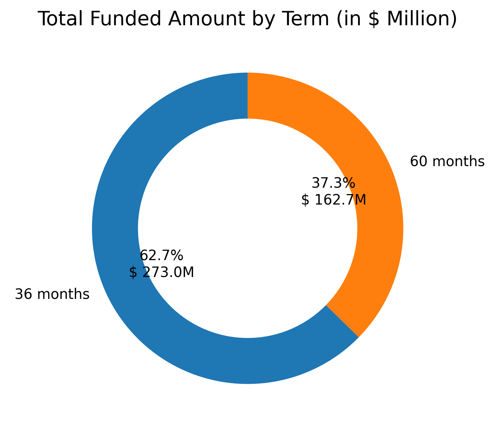 |  |

### 👔 Borrower Employment Profile

| Funded Amount by Employment Length | Amount Received by Employment Length |
|---|---|
| 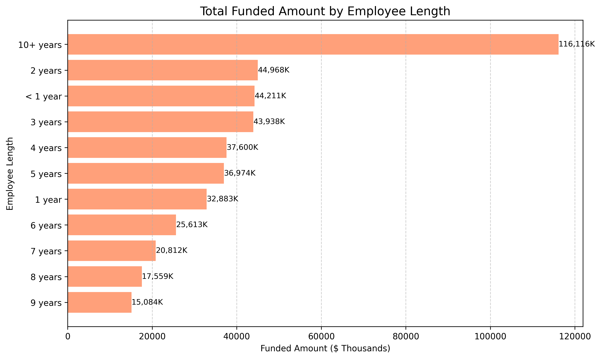 | 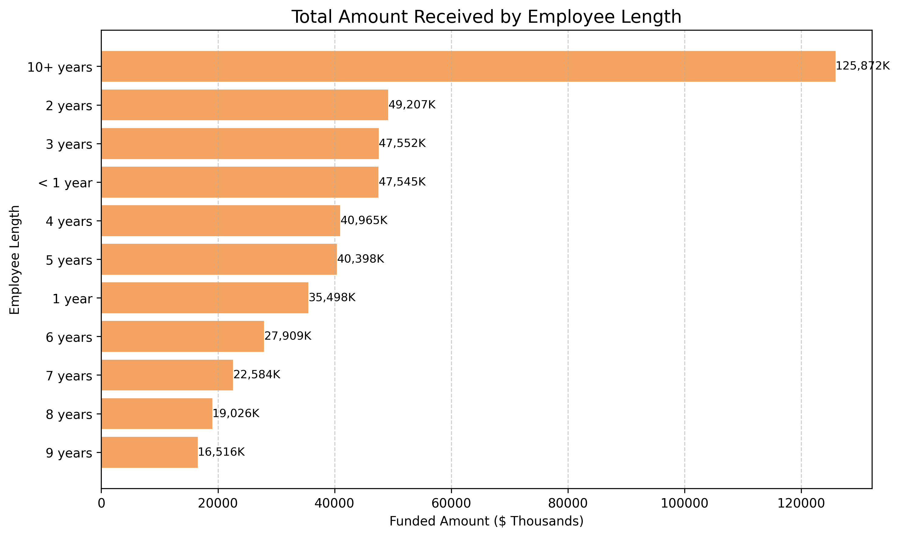 |

### 🎯 Loan Purpose Performance

| Funded Amount by Loan Purpose | Amount Received by Loan Purpose |
|---|---|
| 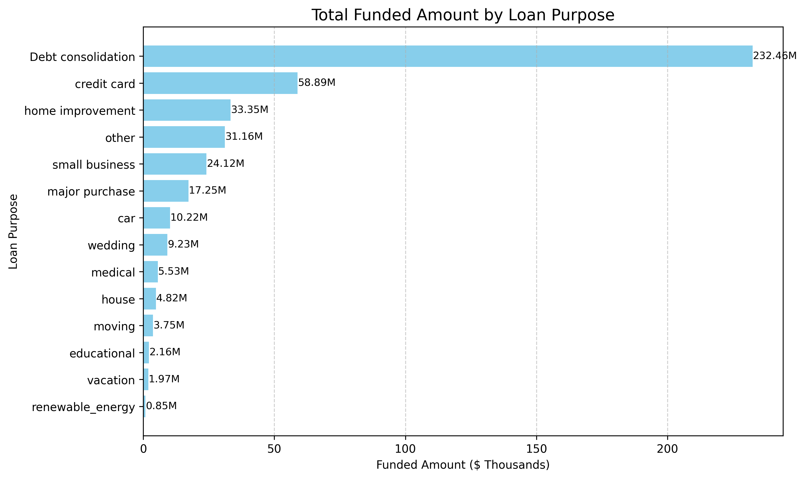 | 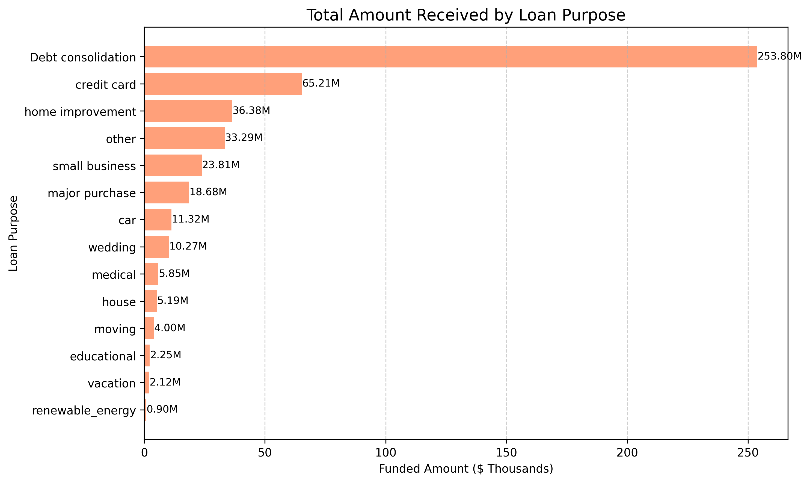 |

### 🏠 Home Ownership Performance

| Funded Amount by Home Ownership | Amount Received by Home Ownership |
|---|---|
| 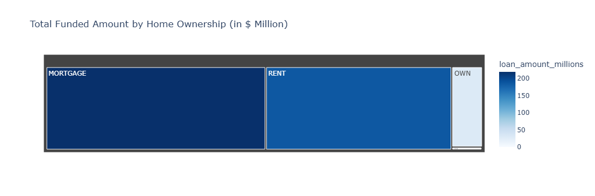 | 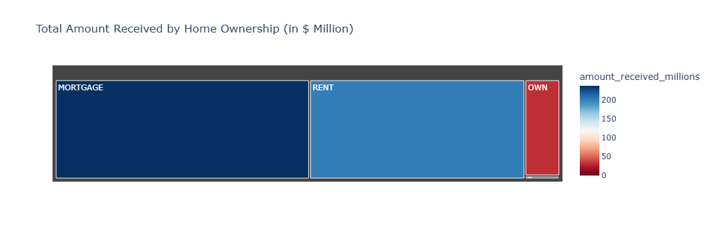 |

## 🔎 Key Findings

### 📈 Portfolio Growth

Loan demand increased steadily throughout 2021, with the highest application volume in **December 2021**. The growth in funded amount and amount received indicates that the bank successfully scaled lending activity while maintaining positive cash inflow.

### 🗺️ Regional Concentration

California is the strongest market across applications, funded amount, and repayment volume.

| Top State | Applications | Funded Amount | Amount Received |
|---|---:|---:|---:|
| CA | 6,894 | $78.48M | $83.90M |
| NY | 3,701 | $42.08M | $46.11M |
| TX | 2,664 | $31.24M | $34.39M |
| FL | 2,773 | $30.05M | $31.60M |

### 🎯 Loan Purpose Concentration

Debt consolidation is the dominant loan purpose and the core revenue driver.

| Top Purpose | Applications | Funded Amount | Amount Received |
|---|---:|---:|---:|
| Debt Consolidation | 18,214 | $232.46M | $253.80M |
| Credit Card | 4,998 | $58.89M | $65.21M |
| Home Improvement | 2,876 | $33.35M | $36.38M |
| Other | 3,824 | $31.16M | $33.29M |

### ⏳ Loan Term Behavior

Borrowers strongly prefer **36-month loans**, which account for the majority of applications and funded capital.

| Term | Applications | Funded Amount | Amount Received |
|---|---:|---:|---:|
| 36 months | 28,237 | $273.04M | $294.71M |
| 60 months | 10,339 | $162.72M | $178.36M |

### 🏠 Home Ownership

Mortgage holders generate the highest funded amount and repayment volume, indicating that they are one of the bank's most valuable borrower segments.

| Home Ownership | Applications | Funded Amount | Amount Received |
|---|---:|---:|---:|
| Mortgage | 17,198 | $219.33M | $238.47M |
| Rent | 18,439 | $185.77M | $201.82M |
| Own | 2,838 | $29.60M | $31.73M |

## 🛠️ Tools & Technologies

| Tool | Purpose |
|---|---|
| 🐍 Python | Data cleaning, KPI calculation, EDA |
| 📓 Jupyter Notebook | Analytical workflow and visual exploration |
| 🐼 Pandas | Data transformation and aggregation |
| 🔢 NumPy | Numerical operations |
| 📊 Matplotlib & Seaborn | Static visualizations |
| 📈 Plotly | Interactive visualizations |
| 🟡 Power BI | Dashboard development and business reporting |
| 📄 PDF Reports | Final analysis documentation |

## 🧱 Project Structure

```text
Credit Risk and Portfolio Analysis/
│
├── Credit Risk and Portfolio Analysis.pbix
│   └── Interactive Power BI dashboard
│
├── Bank_Loan_Analysis.ipynb
│   └── Python EDA, KPI calculations, and visual analysis
│
├── financial_loan.csv
│   └── Source loan portfolio dataset
│
├── Business Problem.pdf
│   └── Business requirements and KPI definition
│
├── Credit Risk and Portfolio Analysis Report.pdf
│   └── Final project report with insights and recommendations
│
├── Bank-Loan-Analysis-Project-Report.pptx
│   └── Presentation version of the project findings
│
├── Images/
│   └── Exported visual charts used in the README gallery
│
└── README.md
    └── Project documentation
```

## 🧹 Data Preparation

The notebook includes the following preparation steps:

- Loaded the financial loan dataset
- Reviewed dataset shape, columns, and data types
- Cleaned date fields for time-based analysis
- Created KPI calculations for applications, funded amount, received amount, interest rate, and DTI
- Segmented loans into good and bad loan categories
- Aggregated results by month, state, purpose, term, employment length, and home ownership
- Built visualizations for portfolio monitoring and executive reporting

## 📌 KPI Definitions

| KPI | Definition |
|---|---|
| Total Loan Applications | Count of all loan application records |
| Total Funded Amount | Total loan capital issued by the bank |
| Total Amount Received | Total repayment collected from borrowers |
| Average Interest Rate | Average interest rate across all loans |
| Average DTI | Average borrower debt-to-income ratio |
| Good Loan Rate | Percentage of loans that are Fully Paid or Current |
| Bad Loan Rate | Percentage of loans that are Charged Off |
| MTD Metrics | Metrics for the latest available month in the dataset |

## 🚀 How to Use This Project

1. Open `Credit Risk and Portfolio_Analysis.ipynb` in Jupyter Notebook.
2. Confirm that `financial_loan.csv` is available in the project folder.
3. Run the notebook cells from top to bottom to reproduce the EDA and KPI calculations.
4. Open `Credit Risk and Portfolio Analysis.pbix` in Power BI Desktop to explore the interactive dashboard.
5. Review `Credit Risk and Portfolio Analysis Report.pdf` for the final written analysis.

## 💡 Business Recommendations

- Strengthen underwriting controls for borrower groups with higher charge-off risk.
- Monitor California exposure because it is the largest regional contributor and a major concentration point.
- Continue supporting debt consolidation loans, but manage product concentration risk carefully.
- Prioritize 36-month loans as the core product due to strong demand and faster capital turnover.
- Use borrower stability indicators such as employment length, home ownership, DTI, and loan grade during approval decisions.
- Track bad loan trends monthly to detect early portfolio deterioration.

## 🏁 Final Conclusion

The bank loan portfolio shows **strong growth, positive repayment performance, and healthy profitability**, with total repayments exceeding funded capital by **$37.31M**. The portfolio is supported by high-performing good loans, strong borrower demand, and consistent monthly growth.

At the same time, risk is concentrated in charged-off loans, specific geographies, and dominant loan purposes. By combining Power BI dashboards with Python analysis, this project gives the bank a practical decision-support system for improving lending strategy, reducing defaults, and protecting long-term profitability.

---

# 🤝 Connect With Me

## 👨‍💻 Author

**Rajay Jain**

* **📧 Email**: jainrajay2001@gmail.com  
* **💼 LinkedIn**: [www.linkedin.com/in/rajay-ajay-jain-a3abb4168](https://www.linkedin.com/in/rajay-ajay-jain-a3abb4168)  
* **🐙 GitHub**: [https://github.com/RajayJain](https://github.com/RajayJain)  

---

## ⭐ Support

If you find this analysis framework resourceful or helpful for your retail applications, please consider giving this project repository a ⭐ on GitHub!
